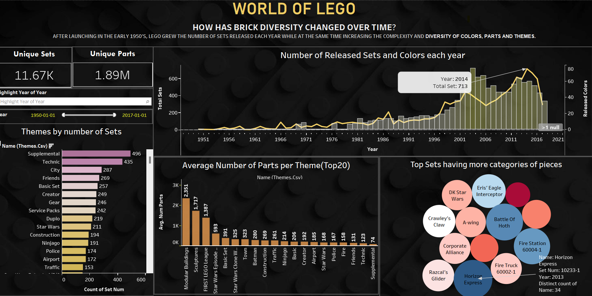

  <h1>THE WORLD OF LEG</h1>

LEGO is a widely recognized brand known for its toy building bricks, often packaged in sets designed to construct specific objects. Each set comprises a variety of parts, encompassing diverse shapes, sizes, and colors. The database in question is a compilation of information detailing the components included in various LEGO sets. Originally created to assist individuals who already owned LEGO sets, the database serves as a valuable resource for determining which additional sets can be constructed using the pieces at hand. 

 
  

Exploring the evolution of LEGO's brick diversity over time, this analysis willinvestigates how the variety of bricks has transformed. Since its inception in the early 1950s, LEGO has not only expanded the quantity of sets introduced annually but has also elevated the intricacy and diversity of colors, parts, and themes concurrently

  

The dataset contains the LEGO parts, sets, colors, and Inventories of every official LEGO set in the rebuildable database. These files are current as of July 2017. This dataset was compiled by Rebrickable, which is a website to help identify what LEGO sets can be built given bricks and pieces from other LEGO sets.

You can access the dataset here: https://rebrickable.com/downloads/ or https://www.kaggle.com/datasets/rtatman/lego-database/data

  

Data Insights : 
- Until 2017, LEGO had released a vast collection, including approximately 11,670 unique sets and an impressive 1,890,000 distinct parts.
- Over the period from 1950 to 2017, there was a continual growth in the number of LEGO sets introduced. The peak occurred in 2014, with a record-breaking 713 sets unveiled, featuring the introduction of 60 newly released colors.
- The supplemental theme stood out with the highest number of sets released, reaching a total of 496 by the end of 2017.
- Analyzing the top 20 themes, the Modular Buildings theme exhibited the highest average number of parts, totaling around 2,351. Following closely, Sculptures claimed the second spot in terms of the average number of parts required to complete the theme.
- The bubble chart illustrates that Horizon Express, released in 2013, stands out as the most diverse set, incorporating a remarkable 34 categories of pieces/parts within its composition.

